# 3D-Engine
---

## Краткое описание

Данный репозиторий представляет собой экспериментальный 3D-движок, в частности, pipeline рендера 3D графики с помощью DirectX 11 и C++14. Он выполнен как решение MS Visual Studio 2022 и является форком другого репозитория - https://github.com/planetchili/3D_Fundamentals , откуда за основу взято приложение с подготовленным swapchain для DirectX 11 и фреймбафером. В дальнейшем разработка ведется самостоятельно. Сам проект - решение для Microsoft Visual Studio 2022. В будущем, результаты работы над этим программным продуктом лягут в реализацию игрового движка.

## Реализованный функционал

- mesh-объекты в виде индексированного списка вершин (треугольников в пространстве)
- загрузка mesh-объектов из файла .obj (с нормалями и без)
- процедурная генерация сферы, куба, панели
- восстановление нормалей для mesh-объектов
- pipeline рендера mesh-объектов: преобразование отдельных вершин => сборка треугольников => обработка треугольников => преобразование 3D-пространства в 2D (перспективное преобразвание) => растеризация треугольников
- cull facing (удаление невидимых граней)
- Z-buffer (учитывание z-компоненты при растеризации)
- Vertex Shader, Geometry Shader и Pixel Shader как гибкие и взаимозаменяемые компоненты pipeline
- динамическое освещение (направленные "directional" источники света и позиционные "point")
- flat shading (плоское закрашивание)
- зеркальный и рассеянный свет (specular и diffuse lighting)
- gouraud shading (закрашивание методом Гуро)
- phong shading (закрашивание методов Фонга)
- текстурирование по связанным вершинам
- простые манипуляции со сценой (поворот, отдаление/приближение)
- однородные координаты
- проекций (в качестве примера реализована матрица перспективной проекции)
- поддержка разных соотношений сторон view-порта
- near clipping + far clipping (удаление невидимых граней для ближней границы видимого объема (frustrum) и дальней)

## Примеры

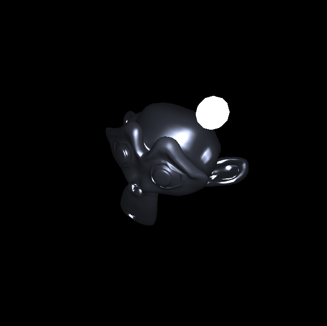

Рендер объекта с глянцевой поверхностью

 

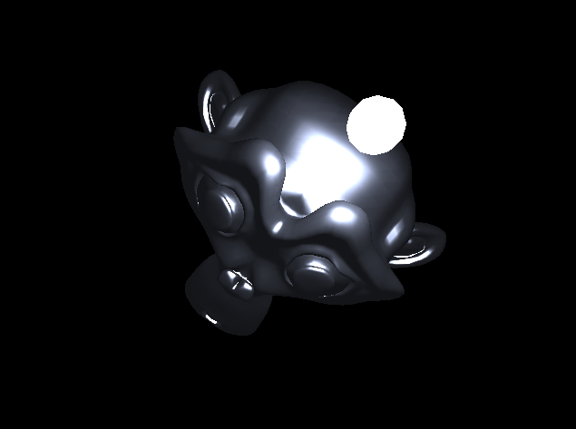

Рендер объекта со соотношениями сторон view-порта 4:3

 

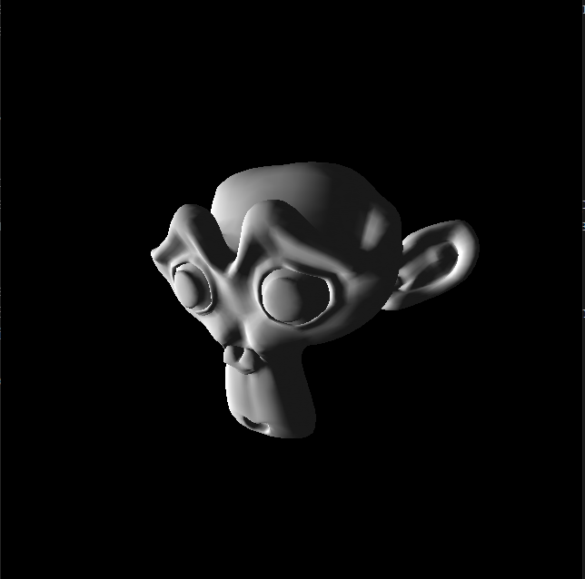

Рендер сложного объекта из файла .obj с нормалями (gouraud shading)

 

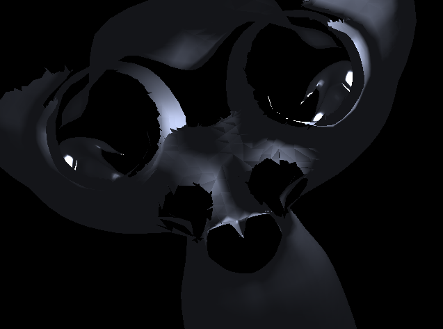

Удаление невидимых граней по видимому объему (frustrum), передняя грань

 

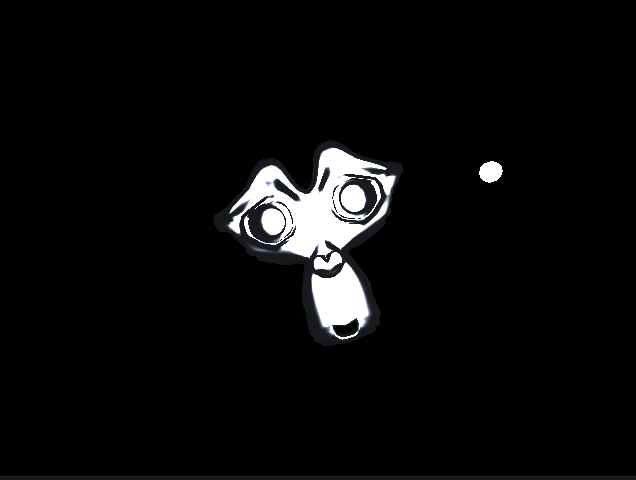

Удаление невидимых граней по видимому объему (frustrum), задняя грань

 

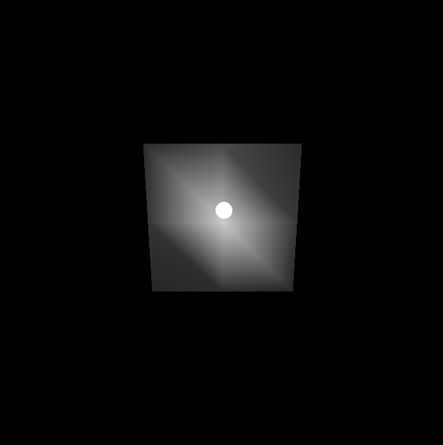

Рендер простого объекта (8 треугольников) с позиционным источником света, метод Гуро

 

Рендер простого объекта (512 треугольников) с позиционным источником света, метод Гуро

 

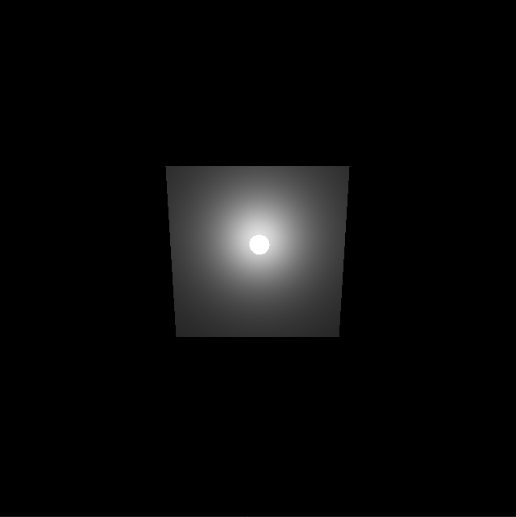

Рендер простого объекта (8 треугольников) с позиционным источником света, метод Фонга

 

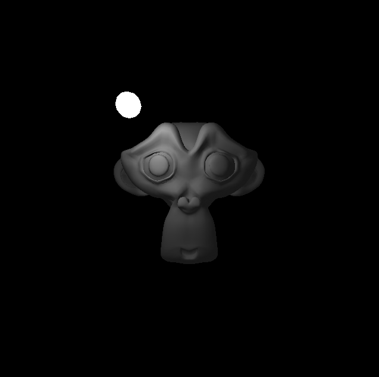

Рендер сложного объекта с позиционным источником света, метод Гуро

 

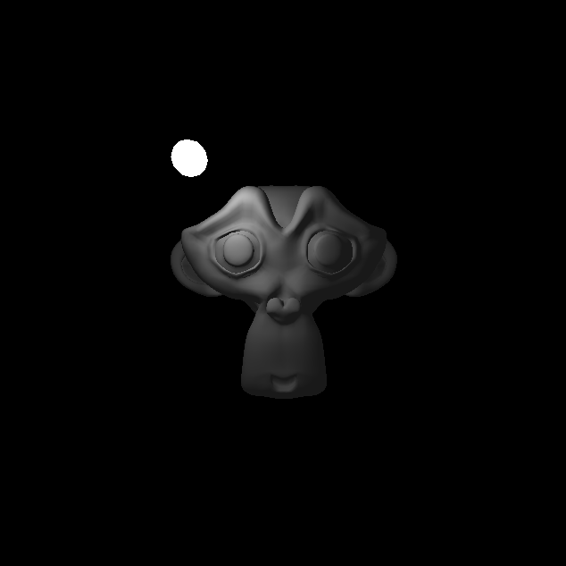

Рендер сложного объекта с позиционным источником света, метод Фонга

 

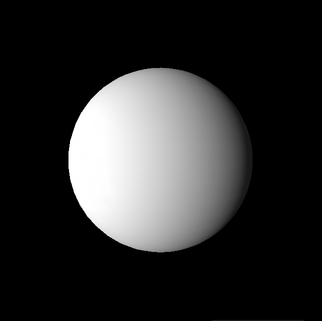

Рендер процедурно генерируемой сферы (gouraud shading)

 

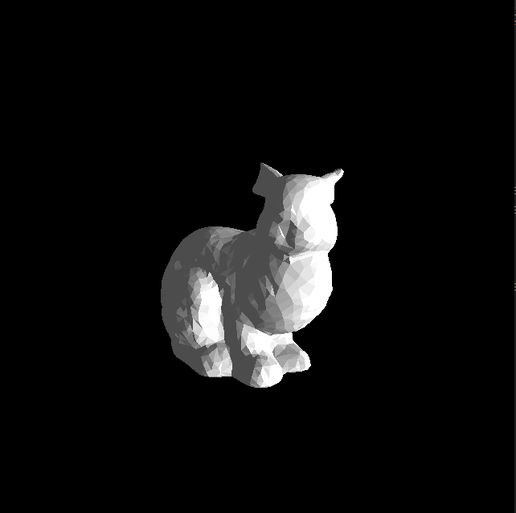

Рендер сложного объекта из файла .obj без нормалей (flat shading)

 

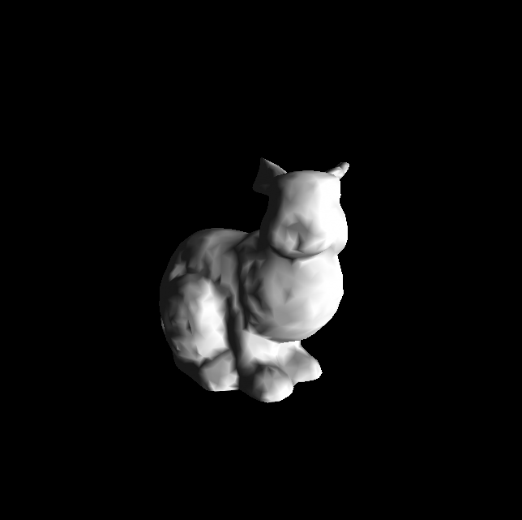

Рендер сложного объекта из файла .obj с процедурной генерацией (восстановлением) нормалей (gouraud shading)

 

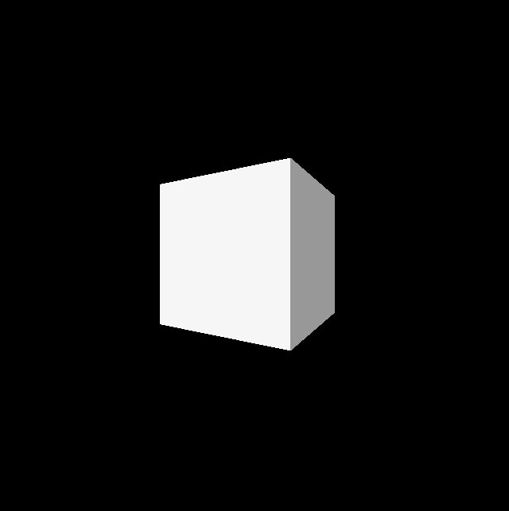

Рендер процедурно генерируемого куба (flat shading)

 

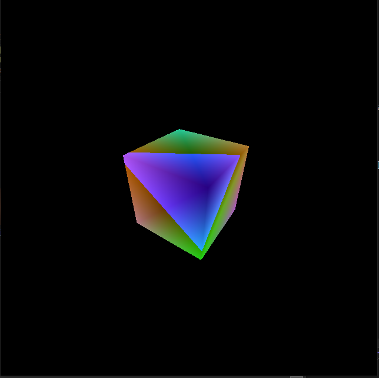

Рендер процедурно генерируемого куба (эксперимент с Vertex Shader: цвет пикселя зависит от его удаления от наблюдателя)

 

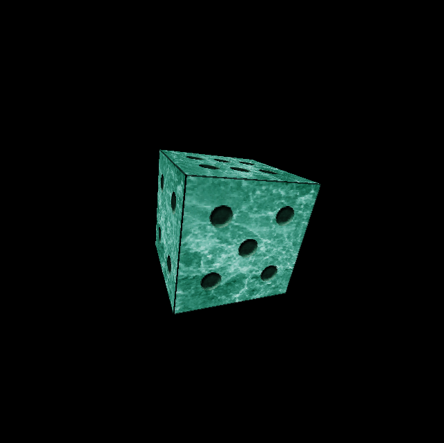

Текстурирование простого объекта (куба)

 

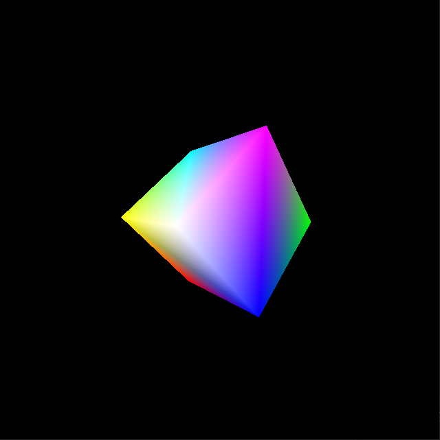

Рендер процедурно генерируемого куба (тест интерполяции вершин)

 

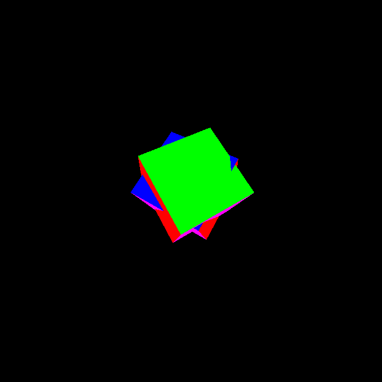

Рендер взаимнопересекающихся объектов (тест Z-Buffer и эксперимент с Geometry Shader: цвет грани куба определяется до растеризации и во время сборки треугольнков)

 

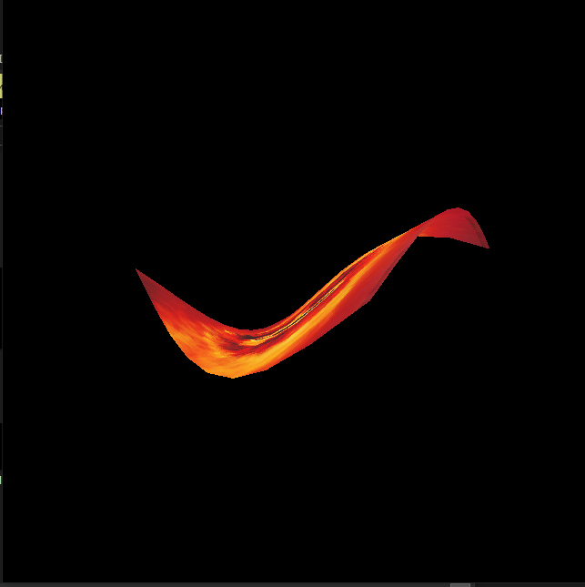
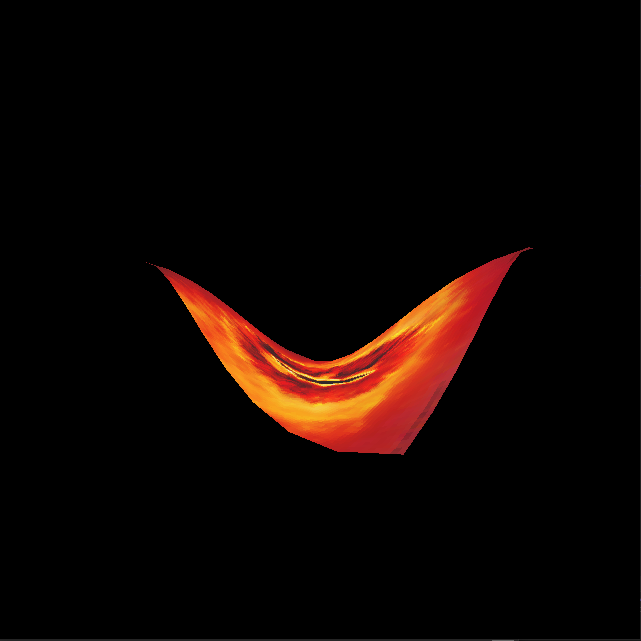

Рендер простой анимации

 

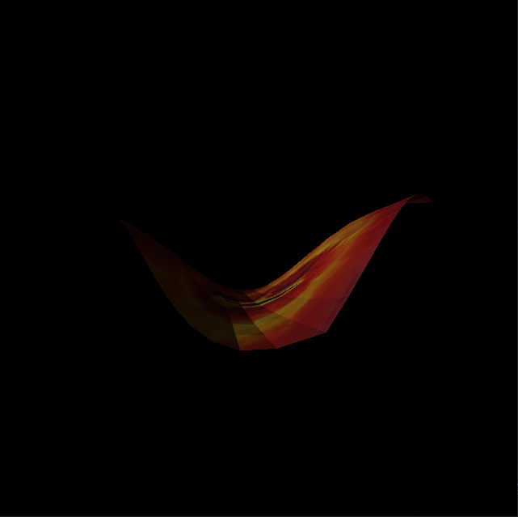

Рендер простой анимации, но с использованием динамического освещения (flat shading)

 